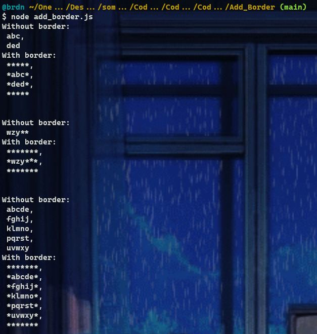
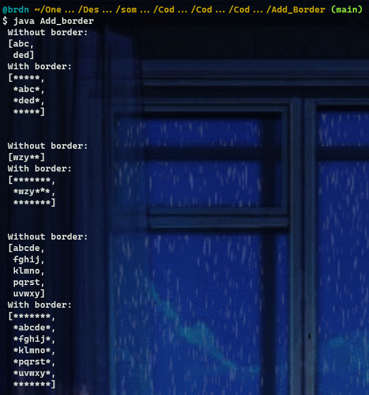

# :large_blue_diamond: Add Border :large_blue_diamond:

## Challenge description

Given a rectangular matrix of characters, add a border of asterisks(<code>*</code>) to it.

Example

For

<pre><code>picture = ["abc",
           "ded"]
</code></pre>

the output should be

<pre><code>solution(picture) = ["*****",
                     "*abc*",
                     "*ded*",
                     "*****"]
</code></pre>

Input/Output

<ul>
<li>

<strong>[execution time limit] 3 seconds (java)</strong>

</li>
<li>

<strong>[memory limit] 1 GB</strong>

</li>
<li>

<strong>[input] array.string picture</strong>

A non-empty array of non-empty equal-length strings.

<em>Guaranteed constraints:</em> 
<code>1 ≤ picture.length ≤ 100</code>, 
<code>1 ≤ picture[i].length ≤ 100</code>.

</li>
<li>

<strong>[output] array.string</strong>

The same matrix of characters, framed with a border of asterisks of width <code>1</code>.

</li>
</ul>

<strong>[Java] Syntax Tips</strong>

## Solutions:

- [JS solution](Add_border.js)
https://github.com/Brnd08/CodeSignalSolutions/blob/6387cc46cac5153e5dc4f126f4aa5228ffdd3daa/Add_Border/Add_border.js#L1-L13

- [Java solution](Add_border.java)
https://github.com/Brnd08/CodeSignalSolutions/blob/6387cc46cac5153e5dc4f126f4aa5228ffdd3daa/Add_Border/Add_border.java#L17-L28

