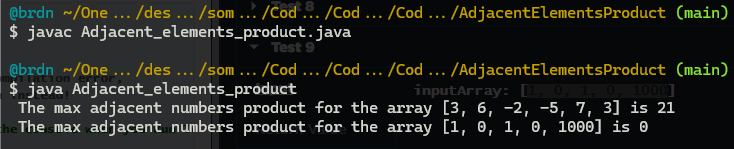

# :large_blue_diamond: Adjacent Elements Product challenge:

## Challenge description

Given an array of integers, find the pair of adjacent elements that has the largest product and return that product.

Example

For <code>inputArray = [3, 6, -2, -5, 7, 3]</code>, the output should be 
<code>solution(inputArray) = 21</code>.

<code>7</code> and <code>3</code> produce the largest product.

Input/Output

<ul>
<li>

<strong>[execution time limit] 3 seconds (java)</strong>

</li>
<li>

<strong>[memory limit] 1 GB</strong>

</li>
<li>

<strong>[input] array.integer inputArray</strong>

An array of integers containing at least two elements.

<em>Guaranteed constraints:</em> 
<code>2 ≤ inputArray.length ≤ 10</code>, 
<code>-1000 ≤ inputArray[i] ≤ 1000</code>.

</li>
<li>

<strong>[output] integer</strong>

The largest product of adjacent elements.

</li>
</ul>

## Solutions:

- [JS solution](Adjacent_elements_product.js)
https://github.com/Brnd08/CodeSignalSolutions/blob/54cf2bb87059fcd5a3e248bf3a3846a650a1f37c/AdjacentElementsProduct/adjacent_elements_product.js#L1-L12

- [Java solution](Adjacent_elements_product.java)
https://github.com/Brnd08/CodeSignalSolutions/blob/54cf2bb87059fcd5a3e248bf3a3846a650a1f37c/AdjacentElementsProduct/Adjacent_elements_product.java#L1-L18 

