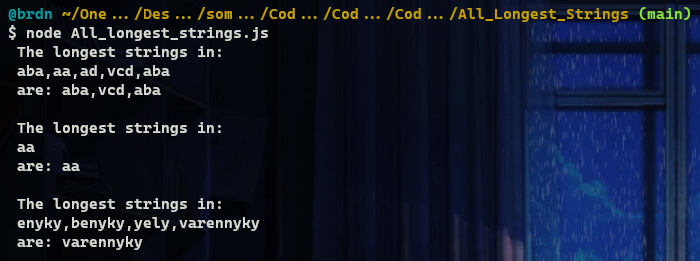
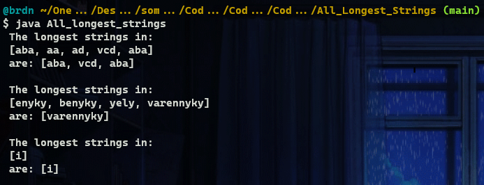

# :large_blue_diamond: All longest Strings :large_blue_diamond:

## Challenge description

Given an array of strings, return another array containing all of its longest strings.

Example

For <code>inputArray = ["aba", "aa", "ad", "vcd", "aba"]</code>, the output should be 
<code>solution(inputArray) = ["aba", "vcd", "aba"]</code>.

Input/Output

<ul>
<li>

<strong>[execution time limit] 3 seconds (java)</strong>

</li>
<li>

<strong>[memory limit] 1 GB</strong>

</li>
<li>

<strong>[input] array.string inputArray</strong>

A non-empty array.

<em>Guaranteed constraints:</em> 
<code>1 ≤ inputArray.length ≤ 10</code>, 
<code>1 ≤ inputArray[i].length ≤ 10</code>.

</li>
<li>

<strong>[output] array.string</strong>

Array of the longest strings, stored in the same order as in the <code>inputArray</code>.

</li>
</ul>

<strong>[Java] Syntax Tips</strong>

## Solutions:

- [JS solution](All_longest_strings.js)
https://github.com/Brnd08/CodeSignalSolutions/blob/8760d0a9d4d2e000813bfa1a3a9cf6d39accfba0/All_Longest_Strings/All_longest_strings.js#L1-L13

- [Java solution](All_longest_strings.java)
https://github.com/Brnd08/CodeSignalSolutions/blob/8760d0a9d4d2e000813bfa1a3a9cf6d39accfba0/All_Longest_Strings/All_longest_strings.java#L14-L27

