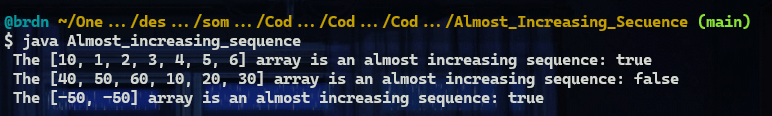

# :large_blue_diamond: Almost increasing sequence challenge:

## Challenge description

Given a sequence of integers as an array, determine whether it is possible to obtain a strictly increasing sequence by removing no more than one element from the array.

<em>Note:</em> sequence <code>a0</code>, <code>a1</code>, ..., <code>an</code> is considered to be a strictly increasing if <code>a0 &lt; a1 &lt; ... &lt; an</code>. Sequence containing only one element is also considered to be strictly increasing.

Example

<ul>
<li>

For <code>sequence = [1, 3, 2, 1]</code>, the output should be 
<code>solution(sequence) = false</code>.

There is no one element in this array that can be removed in order to get a strictly increasing sequence.

</li>
<li>

For <code>sequence = [1, 3, 2]</code>, the output should be 
<code>solution(sequence) = true</code>.

You can remove <code>3</code> from the array to get the strictly increasing sequence <code>[1, 2]</code>. Alternately, you can remove <code>2</code> to get the strictly increasing sequence <code>[1, 3]</code>.

</li>
</ul>

Input/Output

<ul>
<li>

<strong>[execution time limit] 3 seconds (java)</strong>

</li>
<li>

<strong>[memory limit] 1 GB</strong>

</li>
<li>

<strong>[input] array.integer sequence</strong>

<em>Guaranteed constraints:</em> 
<code>2 ≤ sequence.length ≤ 105</code>, 
<code>-105 ≤ sequence[i] ≤ 105</code>.

</li>
<li>

<strong>[output] boolean</strong>

Return <code>true</code> if it is possible to remove one element from the array in order to get a strictly increasing sequence, otherwise return <code>false</code>.

</li>
</ul>

## Solutions:

- [JS solution](Almost_increasing_sequence.js)
https://github.com/Brnd08/CodeSignalSolutions/blob/b17982015cc32bea57323a333ba7b8bbe04d2ba7/Almost_Increasing_Sequence/Almost_increasing_sequence.js#L1-L25

- [Java solution](Almost_increasing_sequence.java)
https://github.com/Brnd08/CodeSignalSolutions/blob/b17982015cc32bea57323a333ba7b8bbe04d2ba7/Almost_Increasing_Sequence/Almost_increasing_sequence.java#L13-L43

