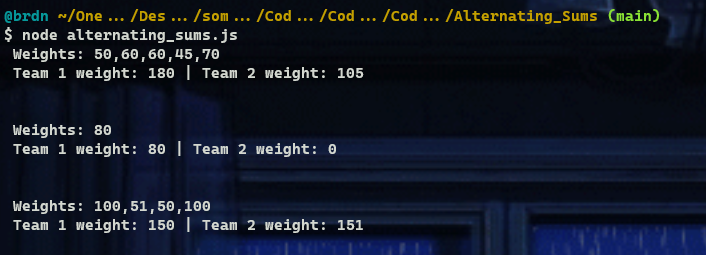
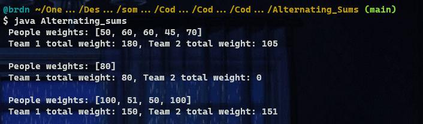

# :large_blue_diamond: Alternating Sums :large_blue_diamond:

## Challenge description

Several people are standing in a row and need to be divided into two teams. The first person goes into <em>team 1</em>, the second goes into <em>team 2</em>, the third goes into <em>team 1</em> again, the fourth into <em>team 2</em>, and so on.

You are given an array of positive integers - the weights of the people. Return an array of two integers, where the first element is the total weight of <em>team 1</em>, and the second element is the total weight of <em>team 2</em> after the division is complete.

Example

For <code>a = [50, 60, 60, 45, 70]</code>, the output should be 
<code>solution(a) = [180, 105]</code>.

Input/Output

<ul>
<li>

<strong>[execution time limit] 3 seconds (java)</strong>

</li>
<li>

<strong>[memory limit] 1 GB</strong>

</li>
<li>

<strong>[input] array.integer a</strong>

<em>Guaranteed constraints:</em> 
<code>1 ≤ a.length ≤ 105</code>, 
<code>45 ≤ a[i] ≤ 100</code>.

</li>
<li>

<strong>[output] array.integer</strong>

</li>
</ul>

<strong>[Java] Syntax Tips</strong>

## Solutions:

- [JS solution](Alternating_sums.js)
https://github.com/Brnd08/CodeSignalSolutions/blob/b142227146ed0acea6a799075a06fa60daa98e0b/Alternating_Sums/Alternating_sums.js#L1-L8

- [Java solution](Alternating_sums.java)
https://github.com/Brnd08/CodeSignalSolutions/blob/b142227146ed0acea6a799075a06fa60daa98e0b/Alternating_Sums/Alternating_sums.java#L15-L20

