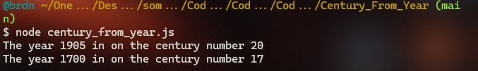
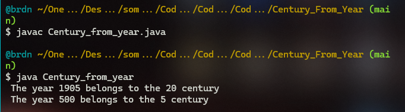

# :large_blue_diamond: Century from year Challenge

## Challenge description

Given a year, return the century it is in. The first century spans from the year 1 up to and including the year 100, the second - from the year 101 up to and including the year 200, etc.

Example

<ul>
<li>For <code>year = 1905</code>, the output should be 
<code>solution(year) = 20</code>;</li>
<li>For <code>year = 1700</code>, the output should be 
<code>solution(year) = 17</code>.</li>
</ul>

Input/Output

<ul>
<li>

<strong>[execution time limit] 4 seconds (js)</strong>

</li>
<li>

<strong>[memory limit] 1 GB</strong>

</li>
<li>

<strong>[input] integer year</strong>

A positive integer, designating the year.

<em>Guaranteed constraints:</em> 
<code>1 ≤ year ≤ 2005</code>.

</li>
<li>

<strong>[output] integer</strong>

The number of the century the year is in.

</li>
</ul>

## Solutions:

- [JS solution](Century_from_year.js)

- [Java solution](Century_from_year.java)

