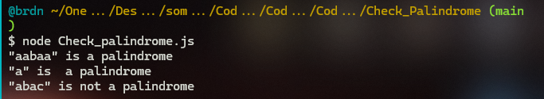
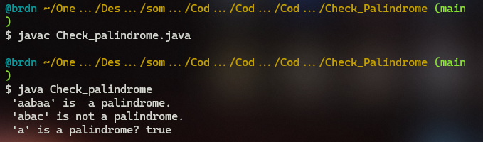

# :large_blue_diamond: Check Palindrome Challenge:

## Challenge description

Given the string, check if it is a <a href="keyword://palindrome" target="_blank">palindrome</a>.

Example

<ul>
<li>For <code>inputString = "aabaa"</code>, the output should be 
<code>solution(inputString) = true</code>;</li>
<li>For <code>inputString = "abac"</code>, the output should be 
<code>solution(inputString) = false</code>;</li>
<li>For <code>inputString = "a"</code>, the output should be 
<code>solution(inputString) = true</code>.</li>
</ul>

Input/Output

<ul>
<li>

<strong>[execution time limit] 3 seconds (java)</strong>

</li>
<li>

<strong>[memory limit] 1 GB</strong>

</li>
<li>

<strong>[input] string inputString</strong>

A non-empty string consisting of lowercase characters.

<em>Guaranteed constraints:</em> 
<code>1 ≤ inputString.length ≤ 105</code>.

</li>
<li>

<strong>[output] boolean</strong>

<code>true</code> if <code>inputString</code> is a palindrome, <code>false</code> otherwise.

</li>
</ul>

<strong>[Java] Syntax Tips</strong>

<pre><code class="language-java">// Prints help message to the console
// Returns a string
// 
// Globals declared here will cause a compilation error,
// declare variables inside the function instead!
String helloWorld(String name) {
    System.out.println("This prints to the console when you Run Tests");
    return "Hello, " + name;
}

</code></pre>

## Solutions:

- [JS solution](Check_palindrome.js)

- [Java solution](Check_palindrome.java)

