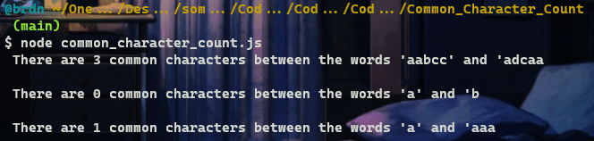
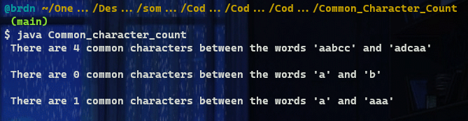

# :large_blue_diamond: Common Character Count :large_blue_diamond:

## Challenge description

Given two strings, find the number of common characters between them.

Example

For <code>s1 = "aabcc"</code> and <code>s2 = "adcaa"</code>, the output should be 
<code>solution(s1, s2) = 3</code>.

Strings have <code>3</code> common characters - <code>2</code> "a"s and <code>1</code> "c".

Input/Output

<ul>
<li>

<strong>[execution time limit] 3 seconds (java)</strong>

</li>
<li>

<strong>[memory limit] 1 GB</strong>

</li>
<li>

<strong>[input] string s1</strong>

A string consisting of lowercase English letters.

<em>Guaranteed constraints:</em> 
<code>1 ≤ s1.length &lt; 15</code>.

</li>
<li>

<strong>[input] string s2</strong>

A string consisting of lowercase English letters.

<em>Guaranteed constraints:</em> 
<code>1 ≤ s2.length &lt; 15</code>.

</li>
<li>

<strong>[output] integer</strong>

</li>
</ul>

<strong>[Java] Syntax Tips</strong>

## Solutions:

- [JS solution](Common_character_count.js)
https://github.com/Brnd08/CodeSignalSolutions/blob/7beab85670cfde3273d25fc005f486ededa1d34f/Common_Character_Count/Common_character_count.js#L1-L11

- [Java solution](Common_character_count.java)
https://github.com/Brnd08/CodeSignalSolutions/blob/7beab85670cfde3273d25fc005f486ededa1d34f/Common_Character_Count/Common_character_count.java#L13-L21

