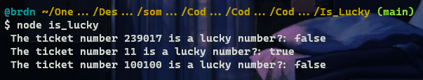
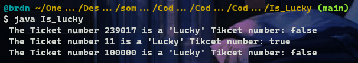

# :large_blue_diamond: Is Lucky :large_blue_diamond:

## Challenge description

Ticket numbers usually consist of an even number of digits. A ticket number is considered <em>lucky</em> if the sum of the first half of the digits is equal to the sum of the second half.

Given a ticket number <code>n</code>, determine if it's <em>lucky</em> or not.

Example

<ul>
<li>For <code>n = 1230</code>, the output should be 
<code>solution(n) = true</code>;</li>
<li>For <code>n = 239017</code>, the output should be 
<code>solution(n) = false</code>.</li>
</ul>

Input/Output

<ul>
<li>

<strong>[execution time limit] 3 seconds (java)</strong>

</li>
<li>

<strong>[memory limit] 1 GB</strong>

</li>
<li>

<strong>[input] integer n</strong>

A ticket number represented as a positive integer with an even number of digits.

<em>Guaranteed constraints:</em> 
<code>10 ≤ n &lt; 106</code>.

</li>
<li>

<strong>[output] boolean</strong>

<code>true</code> if <code>n</code> is a lucky ticket number, <code>false</code> otherwise.

</li>
</ul>

<strong>[Java] Syntax Tips</strong>

## Solutions:

- [JS solution](Is_lucky.js)
https://github.com/Brnd08/CodeSignalSolutions/blob/26a6634884484eef000e51271909014347784afa/Is_Lucky/Is_lucky.js#L1-L13

- [Java solution](Is_lucky.java)
https://github.com/Brnd08/CodeSignalSolutions/blob/26a6634884484eef000e51271909014347784afa/Is_Lucky/Is_lucky.java#L13-L22

