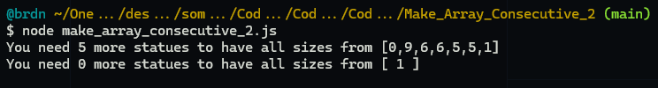
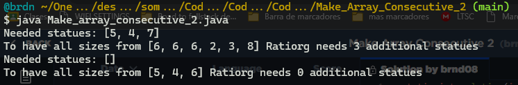
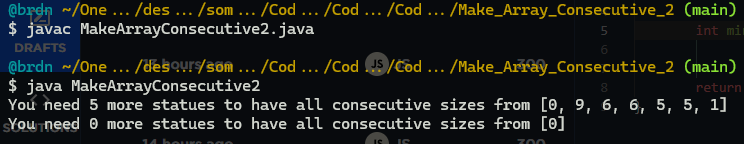

# :large_blue_diamond: Shape Area Challenge

## Challenge description

Ratiorg got <code>statues</code> of <em>different</em> sizes as a present from CodeMaster for his birthday, each statue having an non-negative integer size. Since he likes to make things perfect, he wants to arrange them from smallest to largest so that each statue will be bigger than the previous one exactly by <code>1</code>. He may need some additional statues to be able to accomplish that. Help him figure out the minimum number of additional statues needed.

Example

For <code>statues = [6, 2, 3, 8]</code>, the output should be 
<code>solution(statues) = 3</code>.

Ratiorg needs statues of sizes <code>4</code>, <code>5</code> and <code>7</code>.

Input/Output

<ul>
<li>

<strong>[execution time limit] 3 seconds (java)</strong>

</li>
<li>

<strong>[memory limit] 1 GB</strong>

</li>
<li>

<strong>[input] array.integer statues</strong>

An array of <em>distinct</em> non-negative integers.

<em>Guaranteed constraints:</em> 
<code>1 ≤ statues.length ≤ 10</code>, 
<code>0 ≤ statues[i] ≤ 20</code>.

</li>
<li>

<strong>[output] integer</strong>

The minimal number of statues that need to be added to existing <code>statues</code> such that it contains every integer size from an interval <code>[L, R]</code> (for some <code>L, R</code>) and no other sizes.

</li>
</ul>

## Solutions:

- [JS solution](Make_array_consecutive_2.js)
https://github.com/Brnd08/CodeSignalSolutions/blob/5832427d9d715417fb3b84e7d0d3abd5e40c2335/Make_Array_Consecutive_2/Make_array_consecutive_2.js#L1-L25

- [Java solution](Make_array_consecutive_2.java)
https://github.com/Brnd08/CodeSignalSolutions/blob/d1912aa128868d8e5207671e1278ef17ce434261/Make_Array_Consecutive_2/Make_array_consecutive_2.java#L1-L29

- [Java Arrays API solution](MakeArrayConsecutive2.java)
https://github.com/Brnd08/CodeSignalSolutions/blob/aed58dae1c6dab7ed94d918824eb248a2591d878/Make_Array_Consecutive_2/MakeArrayConsecutive2.java#L1-L18

