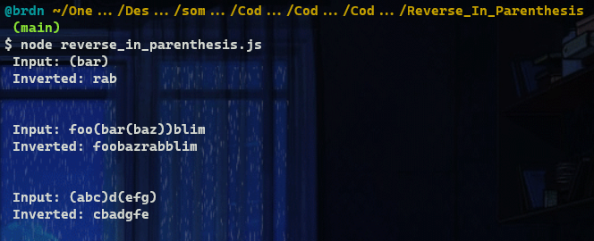
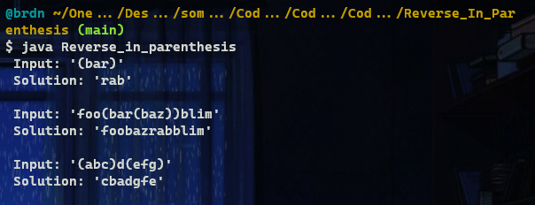

# :large_blue_diamond: Reverse In Parenthesis :large_blue_diamond:

## Challenge description

Write a function that reverses characters in (possibly nested) parentheses in the input string.

Input strings will always be well-formed with matching <code>()</code>s.

Example

<ul>
<li>For <code>inputString = "(bar)"</code>, the output should be 
<code>solution(inputString) = "rab"</code>;</li>
<li>For <code>inputString = "foo(bar)baz"</code>, the output should be 
<code>solution(inputString) = "foorabbaz"</code>;</li>
<li>For <code>inputString = "foo(bar)baz(blim)"</code>, the output should be 
<code>solution(inputString) = "foorabbazmilb"</code>;</li>
<li>For <code>inputString = "foo(bar(baz))blim"</code>, the output should be 
<code>solution(inputString) = "foobazrabblim"</code>. 
Because <code>"foo(bar(baz))blim"</code> becomes <code>"foo(barzab)blim"</code> and then <code>"foobazrabblim"</code>.</li>
</ul>

Input/Output

<ul>
<li>

<strong>[execution time limit] 3 seconds (java)</strong>

</li>
<li>

<strong>[memory limit] 1 GB</strong>

</li>
<li>

<strong>[input] string inputString</strong>

A string consisting of lowercase English letters and the characters <code>(</code> and <code>)</code>. It is guaranteed that all parentheses in <code>inputString</code> form a <a href="keyword://regular-bracket-sequence" target="_blank">regular bracket sequence</a>.

<em>Guaranteed constraints:</em> 
<code>0 ≤ inputString.length ≤ 50</code>.

</li>
<li>

<strong>[output] string</strong>

Return <code>inputString</code>, with all the characters that were in parentheses reversed.

</li>
</ul>

<strong>[Java] Syntax Tips</strong>

## Solutions:

- [JS solution](Reverse_in_parenthesis.js)
https://github.com/Brnd08/CodeSignalSolutions/blob/21bf7587b14f6a2122125f48b111deff6ebdf464/Reverse_In_Parenthesis/Reverse_in_parenthesis.js#L1-L11

- [Java solution](Reverse_in_parenthesis.java)
https://github.com/Brnd08/CodeSignalSolutions/blob/21bf7587b14f6a2122125f48b111deff6ebdf464/Reverse_In_Parenthesis/Reverse_in_parenthesis.java#L15-L23

