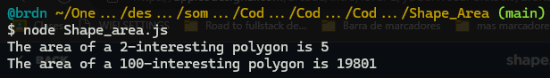
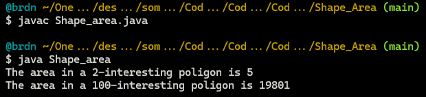

# :large_blue_diamond: Shape Area Challenge

## Challenge description

Below we will define an <code>n</code>-interesting polygon. Your task is to find the area of a polygon for a given <code>n</code>.

A <code>1</code>-interesting polygon is just a square with a side of length <code>1</code>. An <code>n</code>-interesting polygon is obtained by taking the <code>n - 1</code>-interesting polygon and appending <code>1</code>-interesting polygons to its rim, side by side. You can see the <code>1</code>-, <code>2</code>-, <code>3</code>- and <code>4</code>-interesting polygons in the picture below.

Example

<ul>
<li>For <code>n = 2</code>, the output should be 
<code>solution(n) = 5</code>;</li>
<li>For <code>n = 3</code>, the output should be 
<code>solution(n) = 13</code>.</li>
</ul>

Input/Output

<ul>
<li>

<strong>[execution time limit] 3 seconds (java)</strong>

</li>
<li>

<strong>[memory limit] 1 GB</strong>

</li>
<li>

<strong>[input] integer n</strong>

<em>Guaranteed constraints:</em> 
<code>1 ≤ n &lt; 104</code>.

</li>
<li>

<strong>[output] integer</strong>

The area of the <code>n</code>-interesting polygon.

</li>
</ul>

## Solutions:

- [JS solution](Shape_Area.js)
https://github.com/Brnd08/CodeSignalSolutions/blob/ddfb49de4f5890099eaa2e2e29a825286531c4a9/Shape_Area/Shape_Area.js#L1-L9

- [Java solution](Shape_Area.java)
https://github.com/Brnd08/CodeSignalSolutions/blob/ddfb49de4f5890099eaa2e2e29a825286531c4a9/Shape_Area/Shape_area.java#L1-L22

