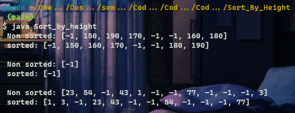
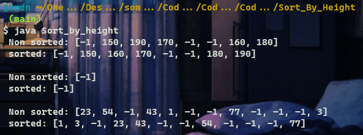

# :large_blue_diamond: Sort by Height :large_blue_diamond:

## Challenge description

Some people are standing in a row in a park. There are trees between them which cannot be moved. Your task is to rearrange the people by their heights in a non-descending order without moving the trees. People can be very tall!

Example

For <code>a = [-1, 150, 190, 170, -1, -1, 160, 180]</code>, the output should be 
<code>solution(a) = [-1, 150, 160, 170, -1, -1, 180, 190]</code>.

Input/Output

<ul>
<li>

<strong>[execution time limit] 3 seconds (java)</strong>

</li>
<li>

<strong>[memory limit] 1 GB</strong>

</li>
<li>

<strong>[input] array.integer a</strong>

If <code>a[i] = -1</code>, then the <code>ith</code> position is occupied by a tree. Otherwise <code>a[i]</code> is the height of a person standing in the <code>ith</code> position.

<em>Guaranteed constraints:</em> 
<code>1 ≤ a.length ≤ 1000</code>, 
<code>-1 ≤ a[i] ≤ 1000</code>.

</li>
<li>

<strong>[output] array.integer</strong>

Sorted array <code>a</code> with all the trees untouched.

</li>
</ul>

<strong>[Java] Syntax Tips</strong>

## Solutions:

- [JS solution](Sort_by_height.js)
https://github.com/Brnd08/CodeSignalSolutions/blob/bfe6e996ae8cb72d84e6e0c7e60a8540bfd84713/Sort_By_Height/Sort_by_height.js#L1-L23

- [Java solution](Sort_by_height.java)
https://github.com/Brnd08/CodeSignalSolutions/blob/bfe6e996ae8cb72d84e6e0c7e60a8540bfd84713/Sort_By_Height/Sort_by_height.java#L16-L38

